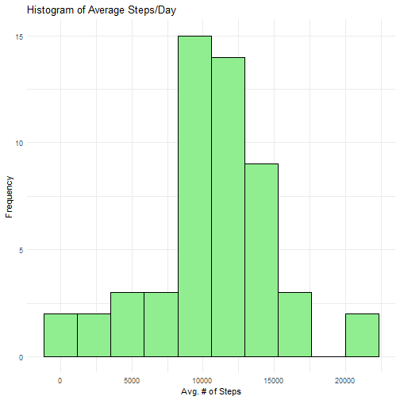
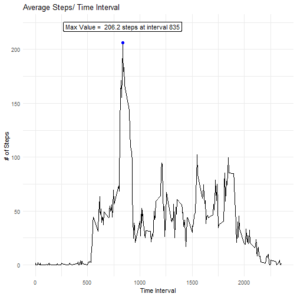
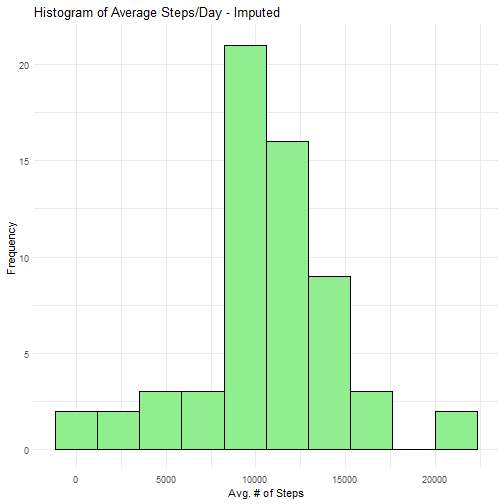
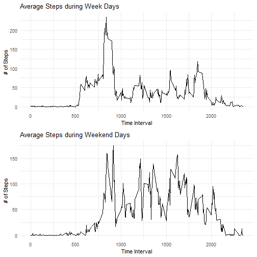

## Loading and preprocessing the data


```r
#load the libraries
library(tidyverse)
library(gridExtra)

options(scipen=999)
#load the data
activitydata <- read_csv("activity.zip")
```

```
## Rows: 17568 Columns: 3
## ── Column specification ─────────────────────────────────────────────────────────────────────────────
## Delimiter: ","
## dbl  (2): steps, interval
## date (1): date
## 
## ℹ Use `spec()` to retrieve the full column specification for this data.
## ℹ Specify the column types or set `show_col_types = FALSE` to quiet this message.
```

```r
summary <- summary(activitydata)
```


## What is mean total number of steps taken per day?

```r
stepcount <- na.omit(activitydata) %>% 
                count(date, 
                      wt = steps, 
                      name = "totalsteps")

p1 <- ggplot(stepcount, aes(totalsteps)) +
        geom_histogram(bins = 10, 
                       color = "black", 
                       fill = "light green") +
        labs(title = "Histogram of Average Steps/Day", 
             x = "Avg. # of Steps", 
             y = "Frequency") +
        theme_minimal()

print(p1)
```


    
  
  
  
  
The mean and median values are close in value ignoring the NA values:  
  
  Mean: $10766.2$  
  Median : $10765$
 

## What is the average daily activity pattern?


```r
intervalgroup <- na.omit(activitydata) %>% group_by(interval) %>% summarize(total = mean(steps))

                                                                          

#----------Find the max average interval------------------------
maxpoint <- intervalgroup[which.max(intervalgroup$total),]

#Create the Plot to show the daily pattern with maximum interval identified
p3 <- ggplot(intervalgroup, aes(interval, total)) +
        geom_line() +
        geom_point(data=maxpoint, 
                   aes(interval, total), 
                   color = "blue", 
                   cex = 2) +
        geom_label(data=maxpoint, 
                   aes(label = paste("Max Value = ", 
                                     round(total,1), "steps at interval", 
                                     interval)), nudge_y = 15) +
        labs(title = "Average Steps/ Time Interval", 
             x = "Time Interval", 
             y = "# of Steps") +
        theme_minimal()

print(p3)
```



## Imputing missing values

The data has NA values for 13.1% of the days. A total of 2304 rows out of a total of 17568 are missing (NA's). The missing data will be imputed by using the average of each time interval dependent on if the day falls during the week or on a weekend. 


```r
#Impute with average values using both the type of day (weekday or weekend) and the time interval

#find the mean of each interval for each type of day (weekend or weekday) dropping the NA's
daytypedata <- na.omit(activitydata) %>% 
        mutate(day = weekdays(date)) %>%
        mutate(daytype = 
                       ifelse(day == "Saturday" | day == "Sunday", 
                              "Weekend", "Weekday")) %>%
        group_by(daytype, interval) %>%
        summarize(mean = mean(steps))
```

```
## `summarise()` has grouped output by 'daytype'. You can override using the `.groups` argument.
```

```r
#Create a dataframe for the NA values and add categorical type of day value 
activitydaytype <- activitydata[is.na(activitydata$steps),] %>%
        mutate(day = weekdays(date)) %>%
        mutate(daytype = ifelse(day == "Saturday" | day == "Sunday", 
                              "Weekend", "Weekday"))
#Create a dataframe or the complete rows and add a categorical type of day value
completes <- activitydata[!is.na(activitydata$steps),] %>%
        mutate(day = weekdays(activitydata$date[!is.na(activitydata$steps)])) %>%
        mutate(daytype = ifelse(day == "Saturday" | day == "Sunday", 
                                "Weekend", "Weekday"))

#Impute the mean values into the NA column
imputes <- activitydaytype %>% 
        left_join(daytypedata, by=c('interval', 'daytype')) %>%
        select(-steps) %>%
        rename(steps = mean)

#combined data set of imputed data ordered by date, time interval
imputeddata <- bind_rows(imputes, completes) %>%
        arrange(date, interval)

stepimputed <- imputeddata %>% 
                count(date, 
                      wt = steps, 
                      name = "totalsteps")

p4 <- ggplot(stepimputed, aes(totalsteps)) +
        geom_histogram(bins = 10, 
                       color = "black", 
                       fill = "light green") +
        labs(title = "Histogram of Average Steps/Day - Imputed", 
             x = "Avg. # of Steps", 
             y = "Frequency") +
        theme_minimal()

print(p4)
```


    
  
  
  
  
The mean value is a little lower and the median value dropped more significantly with the imputed values. Imputing the values with this method averaged out the overall data:  
  
  Mean: $10762.1$  
  Median : $10571$


## Are there differences in activity patterns between weekdays and weekends?


```r
p5data <-  filter(imputeddata, daytype == "Weekday") %>% 
        group_by(interval) %>% summarize(total = mean(steps))
        
    p5 <-    ggplot(p5data, aes(interval, total)) +
        geom_line() +
        labs(title = "Average Steps during Week Days", 
             x = "Time Interval", 
             y = "# of Steps") +
        theme_minimal()

p6data <-  filter(imputeddata, daytype == "Weekend") %>% 
        group_by(interval) %>% summarize(total = mean(steps))        
        
p6 <- ggplot(p6data, aes(interval, total)) +
        geom_line() +
        labs(title = "Average Steps during Weekend Days", 
             x = "Time Interval", 
             y = "# of Steps") +
        theme_minimal()

grid.arrange(p5, p6, ncol = 1)
```


  
  
  
  The plots show that weekend activity is more consistent throughout the day than weekdays activity.
